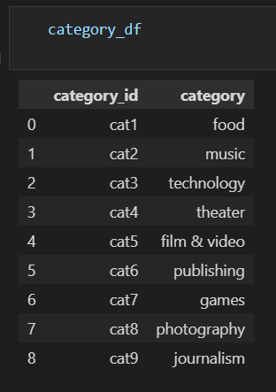
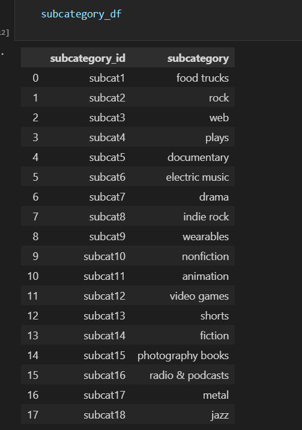
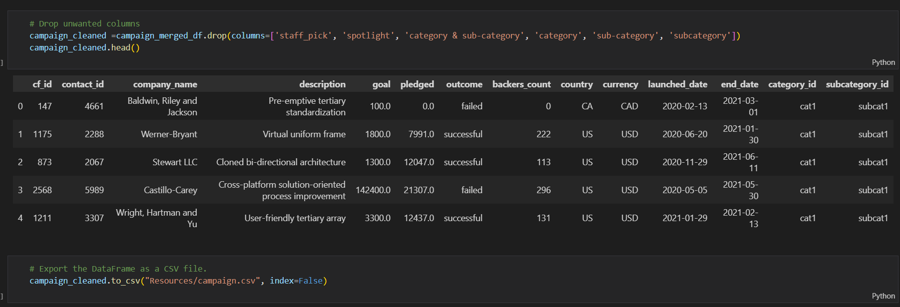
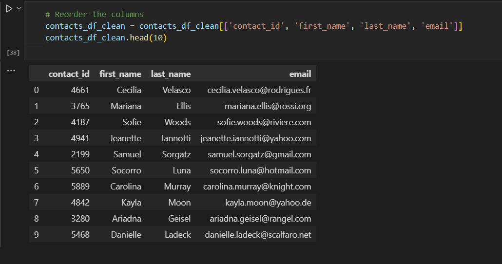
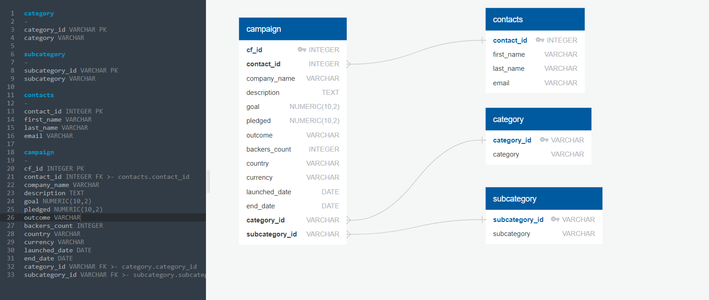

# Crowdfunding_ETL

# Transform data from crowdfunding.xlsx

* Create the campaign_df
* The category & subcategory column is splited into two columns: category, subcategory
* The unique values of category column is extracted and each value is assigned a new category_id by using Numpy.arange
* The category values and category_id are then combined into a new dataframe and exported as category.csv
* The do the same things for the subcategory column, and get subcategory.csv

# Clean the campaign_df

* Rename the columns in campaign_df to make them more readable
* Fix the datatypes of some columns to change them from object to appropriate datatypes
* Fix the date from UTC format to YYYY-MM-DD format
* Merge the campaign df with category df and subcategory df
* Drop some columns to only keep the meaningful ones
* Export the campaign df to campaign.csv
* The final dataframe is shown as:

# Extract information from contacts using regular expression

* Extract the columns: contact_id, name, email one by one
* Split the name column into first_name and last_name
* Reorder the columns and export the dataframe to contacts.csv

# Create the database and import data

* Create the ERD diagram between tables of campaign, category, subcategory, contacts
* Using quickDBD to create tables and draw erd

* Export table information from quickDBD and create the crowfunding database in Postgres
* Create the tables and import data
* Using select* to verify the data in each table

